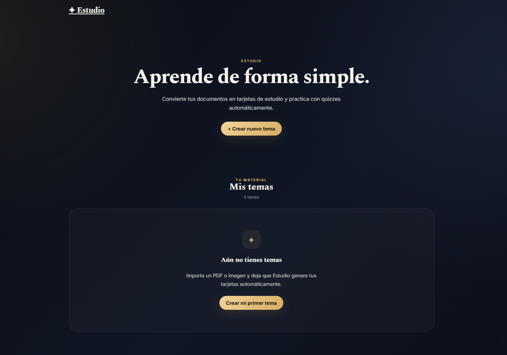
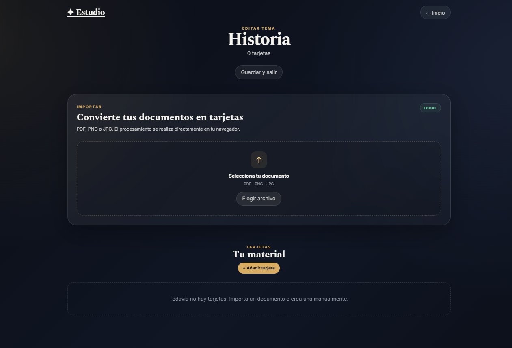
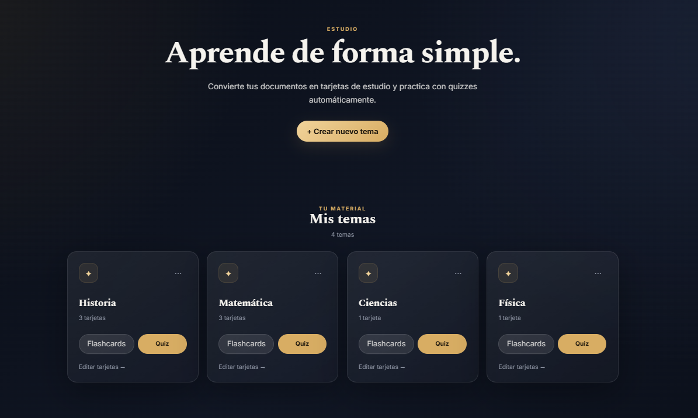
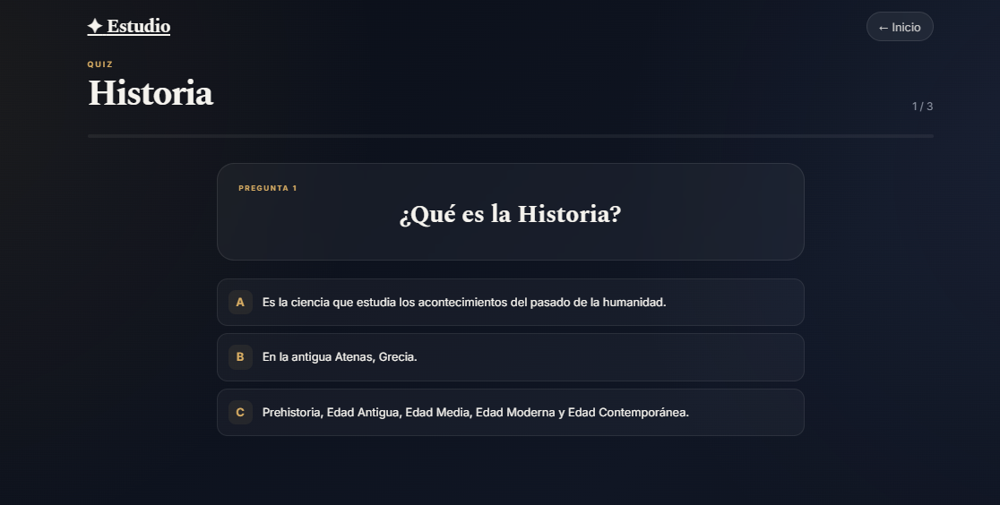

# 📚 Estudio

Aplicación web interactiva diseñada para transformar material de estudio en preguntas, tarjetas y cuestionarios a partir de documentos e imágenes.

🔗 **[🚀 Ver el proyecto en vivo](https://jimenaturcios448.github.io/app_estudio/)**

---

## ✨ Características

- 📄 Importación de archivos PDF.
- 🖼️ Importación de imágenes PNG y JPG.
- 🔎 Extracción automática de texto.
- 👁️ Reconocimiento óptico de caracteres (OCR).
- 🧠 Generación automática de preguntas y respuestas.
- 📚 Creación y organización de temas de estudio.
- 🃏 Tarjetas de estudio interactivas.
- 📝 Modo cuestionario.
- 📊 Visualización de resultados.
- 💾 Guardado de información mediante `localStorage`.
- 🗑️ Eliminación de tarjetas y temas con confirmación.
- 🔔 Sistema de notificaciones personalizado.
- ⌨️ Navegación mediante teclado.
- 📱 Diseño responsive.
- ✨ Interfaz moderna con efectos glassmorphism.
- 🌙 Diseño oscuro.
- ⚡ Aplicación ejecutada directamente desde el navegador.

---

## 🛠️ Tecnologías utilizadas

- **HTML5** — estructura de la aplicación.
- **CSS3** — diseño, responsive design, animaciones y efectos visuales.
- **JavaScript** — lógica, navegación, generación de preguntas y gestión de datos.
- **PDF.js** — extracción de texto de archivos PDF.
- **Tesseract.js** — reconocimiento óptico de caracteres (OCR).
- **LocalStorage** — almacenamiento local de temas y tarjetas.
- **Git** — control de versiones.
- **GitHub** — alojamiento del proyecto.
- **GitHub Pages** — publicación de la aplicación.

---

## 📂 Estructura del proyecto

```text
app_estudio/
│
├── capturas/
│   ├── estudio.png
│   ├── importacion.png
│   ├── inicio.png
│   └── quiz.png
│
├── index.html
├── README.md
├── script.js
└── style.css
```

---

## 🔎 Funcionalidades principales

### 📄 Importación de documentos

Estudio permite importar documentos PDF directamente desde la aplicación.

El sistema analiza el documento y extrae automáticamente el texto disponible.

Cuando el PDF contiene páginas escaneadas o imágenes sin texto seleccionable, se utiliza OCR para reconocer el contenido.

### 🖼️ Importación de imágenes

También es posible importar imágenes para convertir su contenido en texto.

Formatos compatibles:

- PNG
- JPG
- JPEG

El sistema utiliza **Tesseract.js** para reconocer el texto contenido en las imágenes.

### 🧠 Generación de preguntas

Después de extraer el contenido, Estudio analiza el texto y busca diferentes estructuras que pueden convertirse en preguntas y respuestas.

El sistema puede detectar:

- Preguntas y respuestas explícitas.
- Definiciones.
- Conceptos importantes.
- Eventos.
- Encabezados acompañados de información.
- Párrafos con contenido relevante.

Las preguntas generadas pueden utilizarse posteriormente en las tarjetas de estudio y cuestionarios.

### 🃏 Tarjetas de estudio

Las tarjetas permiten repasar el contenido de manera interactiva.

Cada tarjeta contiene:

- ❓ Pregunta.
- 💡 Respuesta.
- 🔄 Interacción para estudiar.
- 🗑️ Opción para eliminar la tarjeta.

Los temas y tarjetas se almacenan localmente en el navegador.

### 📝 Cuestionario

El modo cuestionario permite utilizar las preguntas generadas para realizar una sesión de práctica.

Durante el cuestionario se puede:

- Responder preguntas.
- Avanzar entre preguntas.
- Utilizar navegación mediante teclado.
- Finalizar el cuestionario.
- Consultar los resultados obtenidos.

### 📊 Resultados

Al finalizar un cuestionario, Estudio muestra un resumen de la sesión.

Esto permite revisar el resultado obtenido y volver a estudiar el contenido cuando sea necesario.

### 💾 Almacenamiento local

Los temas y tarjetas se almacenan mediante `localStorage`.

Esto permite conservar la información incluso después de cerrar y volver a abrir el navegador.

La aplicación no necesita una base de datos ni un servidor backend para sus funciones principales.

### 🗑️ Gestión de temas y tarjetas

Los usuarios pueden eliminar temas y tarjetas.

Antes de realizar una eliminación, Estudio muestra una ventana de confirmación personalizada para evitar eliminaciones accidentales.

### 🔔 Notificaciones

La aplicación utiliza un sistema de notificaciones integrado visualmente con la interfaz.

Esto evita depender de los cuadros de diálogo predeterminados del navegador.

### 📱 Diseño responsive

La interfaz se adapta a diferentes tamaños de pantalla para facilitar su utilización en:

- 💻 Computadoras.
- 📱 Teléfonos móviles.
- 📲 Tablets.

---

## 📸 Capturas de pantalla

### 🏠 Página de inicio



### 📄 Importación de documentos



### 🃏 Modo de estudio



### 📝 Cuestionario



---

## 🌐 Proyecto publicado

La aplicación está disponible mediante GitHub Pages.

### 🚀 Abrir Estudio

**[👉 Ver aplicación en vivo](https://jimenaturcios448.github.io/app_estudio/)**

### 💻 Código fuente

**[👉 Ver repositorio en GitHub](https://github.com/jimenaturcios448/app_estudio)**

---

## 🚀 Cómo ejecutar el proyecto

Estudio no requiere instalar dependencias adicionales para utilizar sus funciones principales.

### Opción 1 — Abrir directamente

Descarga o clona el repositorio y abre:

```text
index.html
```

en un navegador web.

### Opción 2 — Visual Studio Code

1. Clona el repositorio.
2. Abre la carpeta `app_estudio` en Visual Studio Code.
3. Abre el archivo `index.html`.
4. Ejecuta el proyecto utilizando un servidor local como **Live Server**.

---

## 📥 Clonar el proyecto

Para obtener una copia local del proyecto:

```bash
git clone https://github.com/jimenaturcios448/app_estudio.git
```

Después entra en la carpeta:

```bash
cd app_estudio
```

Luego puedes abrir la carpeta en Visual Studio Code.

---

## 🔗 Librerías utilizadas

### PDF.js

Utilizada para procesar y extraer texto de documentos PDF.

[PDF.js](https://mozilla.github.io/pdf.js/)

### Tesseract.js

Utilizada para realizar reconocimiento óptico de caracteres (OCR).

[Tesseract.js](https://tesseract.projectnaptha.com/)

---

## 🎯 Objetivo del proyecto

Estudio fue desarrollado como parte de un portafolio de desarrollo de software con el objetivo de demostrar conocimientos en:

- Desarrollo frontend.
- HTML5.
- CSS3.
- JavaScript.
- Manipulación del DOM.
- Procesamiento de documentos.
- Reconocimiento óptico de caracteres.
- Generación dinámica de contenido.
- Almacenamiento local.
- Diseño responsive.
- Diseño de interfaces modernas.
- Animaciones y transiciones.
- Integración de librerías externas.
- Control de versiones con Git.
- Uso de GitHub.
- Publicación mediante GitHub Pages.

---

## 📚 Aprendizajes

Durante el desarrollo del proyecto se trabajaron conceptos como:

- Creación de interfaces web desde cero.
- Separación de estructura, estilos y lógica.
- Manipulación del DOM mediante JavaScript.
- Manejo de eventos.
- Uso de `localStorage`.
- Procesamiento de archivos PDF.
- Implementación de OCR.
- Generación dinámica de elementos HTML.
- Creación de tarjetas de estudio.
- Implementación de cuestionarios.
- Creación de ventanas modales.
- Diseño responsive.
- Integración de librerías externas.
- Organización de proyectos frontend.
- Uso de Git y GitHub.
- Publicación de aplicaciones mediante GitHub Pages.

---
## 👩‍💻 Autora

**Jimena Turcios**

Proyecto desarrollado como parte de un portafolio de desarrollo de software.

🔗 [**GitHub — jimenaturcios448**](https://github.com/jimenaturcios448)

---

## 📄 Licencia

Este proyecto fue desarrollado con fines educativos y de portafolio.